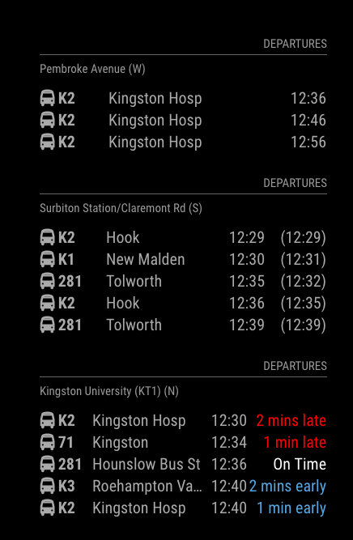

# MMM-UKLiveBusStopInfo
Additional Module for MagicMirror²  https://github.com/MichMich/MagicMirror

**Please note** - I no longer run a MagicMirror, so this module is no-longer supported. Feel free to fork and update as necessary.

# Module: UKLiveBusStopInfo
Magic Mirror Module for UK bus information. Returns real-time info about a SPECIFIC bus stop(s).



## Using the module

Git clone from this repository into the modules sub-directory of the Magic Mirror installation, change directory into the newly cloned code and then run npm install.

```bash
git clone https://github.com/nwootton/MMM-UKLiveBusStopInfo.git
cd MMM-UKLiveBusStopInfo
npm install
```

To use this module, add it to the modules array in the `config/config.js` file:

```javascript
modules: [
    {
		module: 	'MMM-UKLiveBusStopInfo',
		position: 	'bottom_left',
		header:		'Departures',			//Optional - delete this line to turn OFF the header completely
		config: {
			atcocode: 		'490015165B', 		// ATCO code for specific bus stop
			app_id: 		'', 				// TransportAPI App ID
			app_key: 		'', 	            // TransportAPI App Key
			limit: 			5, 					// Optional - Maximum results to display.
      		nextBuses: 		'no',              	// Optional - Use expensive RealTime info from NextBuses
      		showRealTime: 	false,          	// Optional - show realtime departure info
      		showDelay: 		false              	// Optional - show delay in minutes based on Real Time info vs Time table
		}
	},
]
```
There are 3 MANDATORY fields - `atcocode`, `app_id` and `app_key`. All the others are used to limit the amount of info you get back, especially useful for busy bus stops that serve multiple routes.

**PLEASE NOTE** The TransportAPI provides a sample key in their documentation that I previously referenced here. This is being removed very soon, so you *MUST* register to get this module to work!

The following is taken from the TransportAPI documentation [here](https://developer.transportapi.com/docs?raml=https://transportapi.com/v3/raml/transportapi.raml##request_uk_bus_stop_atcocode_live_json)

|Option|Required Settings Description|
|---|---|
|`atcocode`|String. The bus stop you require information about.<br><br>This value is **REQUIRED** <br/>**Example**: 490015165A <br />|
|`api_id`|String. Your TransportAPI app_id [Get yours here](https://developer.transportapi.com/signup).<br><br>This value is **REQUIRED**  <br/>**Example**: 03zf7118 <br />|
|`app_key`|String. Your TransportAPI app_key [Get yours here](https://developer.transportapi.com/signup).<br><br>This value is **REQUIRED** <br/>**Example**: z9307fd87b0000c107e098d5effedc97 <br />|

|Option|Optional Settings Description|
|---|---|
|`updateInterval`| Time between updates in ms. <br/><br/>**Default:** 300000 (5 minutes)|
|`limit`|Integer. Number of departures to return.<br><br>**Default:** 5|
|`nextBuses`|String. Set this to 'yes' if you want to enable expensive calls to NextBuses. See notes below.<br><br>**Default:** 'no'|
|`showRealTime`| Boolean. Show realtime departure info when used with NextBuses. <br><br>**Default:** false|
|`showDelay`| Boolean. Show delay in minutes based on Real Time info vs Time table. Only accurate when used with NextBuses <br><br>**Default:** false|
|`showBearing`| Boolean. Show compass direction/bearing of bus. <br><br>**Default:** false|


## Notes ##
To find the ATCOCode of a bus stop look at the OpenStreetMap.org transport layer and query the bus stop you are interested in.

By EXPENSIVE the cost of a call to the API without nextBuses is 1. With nextBuses it is 10. The limit is 1000 hits per day for a free account. So with a refresh rate of 5 minutes (default) and nextBuses on, you will make 288 calls per module per day (1440 minutes/day divided by 5 = 288). At 10 API points per request, that's 2880 points, almost 2000 more points a day than the free TransportAPI access allows.

## Transport API

To setup an account for the App_id & app_key sign up for an account here: http://www.transportapi.com/

## Troubleshooting

If there are issue getting data out of the module I'm ALWAYS going to ask the following:

1. Do you have an account set up at Transportapi.com?
2. Do you have an app_id and app_key set up?
3. Do you know the ATCOCode for the bus stop??
4. If you use the live api documentation [here](https://developer.transportapi.com/docs?raml=https://transportapi.com/v3/raml/transportapi.raml##uk_bus_stop_atcocode_live_json) and put in the info you want to use does it respond without an error?
5. Is the info in your config the same as that you’ve used successfully in the live api docs?
6. Please provide your config - at the minimum include the ATCOCode in the report - each operator supplies information slightly differently. While TransportAPI does catch most of these, I might not have.
